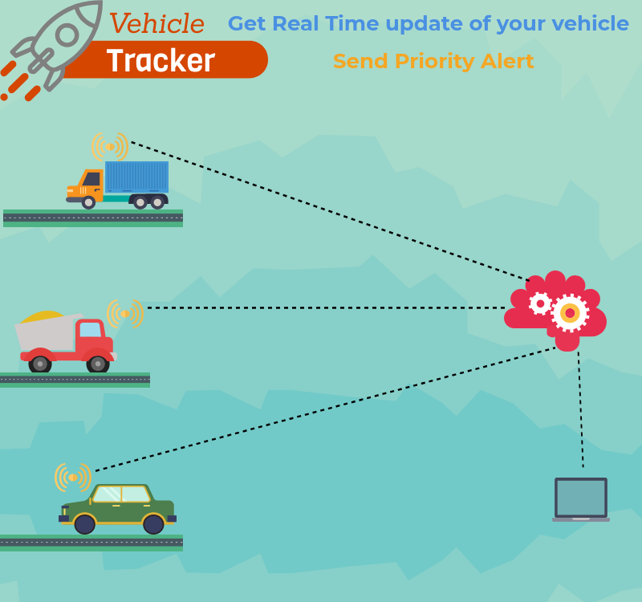

This is a **Vehicle Tracking Application** developed using **Spring Boot** and **RESTful APIs**. The application receives reading from a registered vehicle using well defined REST end points. The reading data is stored in a database which can be further analyzed at backend using data analytics. The application can also be used retrieve information about a registered vehicle like vehical information, alerts and so on.

To **Run** the application:  
*mvnw spring-boot:run*